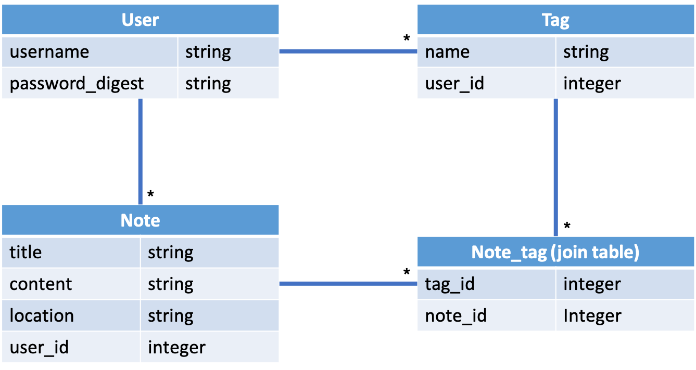

# Scribe

Scribe (formerly NoteBuddy) use a React [frontend](https://github.com/imanj12/notebuddy-frontend) and a Rails backend.

Users can create a new note, edit, and tag the note. Note editing is done using a rich text editor. NoteBuddy supports searching and viewing notes by tag.

## Details

This is a straightforward Rails API backend using a PostgreSQL database. To set it up for yourself, simply create the database and run the migrations.

The model relationships are as follows:

## JSON Web Tokens

User authentication is done using JSON Web Tokens. A JWT secret must be provided as a local environment variable with the name `JWTSECRET` for the current controller configurations to work.
